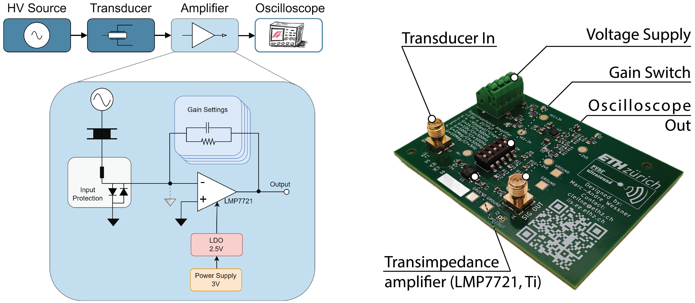

# PEtra: A Flexible and Open-Source PE Loop Tracer

## Overview
PEtra is an open source, versatile polarisation electric field (PE) loop tracer designed to accurately characterise the ferroelectric properties of polymeric piezoelectrics. It has been developed to overcome the limitations of traditional charge measurement techniques such as the Sawyer tower circuit, particularly for screen-printed poly(vinylidene fluoride-tetrafluoroethylene) (P(VDF-TrFE)) transducers.
PEtra achieves sensitivity as low as 2 pA and supports a wide frequency range, making it ideal for optimising the performance of flexible and wearable ultrasound transducers.

> *IMPORTANT NOTE:* This document describes the setup and measurement functions of PEtra. We do not cover the methods or equipment required to generate the bipolar (e.g. sinusoidal) inputs needed to load the transducer for characterisation.





## Features
- **Ultra-Low Current Sensitivity:** Measures currents down to 2 pA.
- **Adjustable Gain Settings:** Transimpedance gains from 10³ V/A to 10⁷ V/A.
- **Wide Frequency Range:** 0.1 Hz to 200 Hz for most gain settings.
- **Open-Source Design:** Fully documented hardware available on [GitHub](https://github.com/pulp-bio/PEtracer).
- **Suitable for Polymer Piezoelectric:** Optimized for screen-printed P(VDF-TrFE) transducers with slow switching times.


## Applications
- Characterizing PE loops in ferroelectric polymers.
- Optimizing fabrication processes for screen-printed P(VDF-TrFE) devices.
- Research on flexible and wearable ultrasound transducers.


## Hardware Components
1. **Transimpedance Amplifier (TIA):** LMP7721 (Texas Instruments) op-amp with ultra-low input bias current of 3 fA.
2. **Selectable Gain Network:** DIP switch for adjusting feedback resistors and capacitors.
3. **Input Protection Circuit:** Fuse and clipping diodes to safeguard the TIA.
4. **Power Supply:** Low-dropout regulator (LDO) providing a stable ±2.5V supply.
5. **Interaction Points:**
   - **Transducer In:** Current input and virtual ground.
   - **Voltage Supply:** Power input.
   - **Gain Switch:** Gain selection via DIP switch.
   - **Oscilloscope Out:** Signal output for measurement.


## Setup Instructions
### 1. Assemble the Hardware
Refer to the schematics and PCB layout available in the [GitHub repository](https://github.com/pulp-bio/PEtracer). Ensure all components are soldered correctly and check for proper connections.

### 2. Connecting the transducer
1. Connect one electrode of your transducer to the excitation voltage supply:
   - Make sure that this circuit is isolated from earth. 
   - If necessary, take into account the direction of polarisation of the transducer.
2. Connect the second electrode of the transducer to the **Transducer In** terminal on PEtra.

### 3. Power-up PEtra
1. Connect a stable ±2.5V power supply to the **Voltage Supply** terminal.
2. Verify the power LEDs light up to confirm correct operation.

### 4. Adjust Gain Settings
Use the DIP switch to select the desired transimpedance gain based on the expected current range:
- 10³ V/A to 10⁷ V/A (decade steps).

### 5. Output Signal Measurement
1. Connect the **Oscilloscope Out** terminal to an oscilloscope of your choice.
2. Measure the output voltage corresponding to the amplified current.


## Example Usage

### Measuring a PE Loop
1. Set up the transducer as per the instructions above.
2. Apply a sinusoidal voltage to the transducer.
3. Observe the PE loop by plotting the output signal from PEtra.

### Optimizing Transducer Design
1. Measure the hysteresis characteristics (e.g., remnant polarization, coercive field).
2. Adjust the fabrication process based on the observed PE loops.


## Repository Structure
- `./hw` - Schematics and PCB layouts.
- `./data` - PEtra image data.

## Contributors

PEtra was developed at the [Integrated Systems Laboratory (IIS)](https://iis.ee.ethz.ch/) at ETH Zurich by:
- [Marc-André Wessner](https://www.linkedin.com/in/marcandre-wessner/) (Hardware Design, Simulation and Characterization)
- [Federico Villani](https://scholar.google.com/citations?hl=en&user=5LgLMCEAAAAJ) (Hardware Verification, Characterization and Validation)
- [Christoph Leitner](https://scholar.google.com/citations?user=_gUK_isAAAAJ&hl=en) (Conceptualization, Methodology and Supervision)

Thanks to all the people who contributed to the PEtra platform: [Luca Benini](https://scholar.google.com/citations?user=8riq3sYAAAAJ&hl=en&oi=ao), [Francesco Greco](https://scholar.google.com/citations?hl=en&user=-YzZbl8AAAAJ), [Kirill Keller](https://scholar.google.com/citations?hl=en&user=LKh_eWoAAAAJ), [Sofia Papa](https://www.linkedin.com/in/sofia-papa-a442a7188/),  [Laura M. Ferrari](https://scholar.google.com/citations?user=vNBGL2kAAAAJ&hl=en&oi=ao)

## Citation
If you would like to reference the project, please cite the following [paper](https://ieeexplore.ieee.org/abstract/document/10793576):

```
@inproceedings{wessner2024petra,
  author={Wessner, Marc-Andre and Villani, Federico and Papa, Sofia and Keller, Kirill and Ferrari, Laura and Greco, Francesco and Benini, Luca and Leitner, Christoph},
  booktitle={2024 IEEE Ultrasonics, Ferroelectrics, and Frequency Control Joint Symposium (UFFC-JS)}, 
  title={PEtra: A Flexible and Open-Source PE Loop Tracer for Polymer Thin-Film Transducers}, 
  year={2024},
  pages={1-4},
  doi={10.1109/UFFC-JS60046.2024.10793576}}
```


## License
This repository is released under Solderpad v0.51 (`SHL-0.51`). For details see `./LICENSE.hw`. Files in the `./data` directory are released under Creative Commons Attribution 4.0 International License (`CC-BY-4.0`); refer to `./LICENSE.data` for more information.